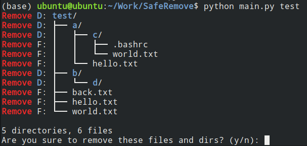

# SafeRemove
This is a Linux tool which aims to safe remove files only depends on python.
## Usage


You can use the following code to safely delete files with a preview.
```
python main.py <path1> <path2> ...
```
Press 'y', 'Y' or nothing and then Enter, the files will be deleted, otherwise the files will be kept.
Mention that the path supports **regular expression**, so you can use the following code to delete all files in the current directory.
```
python main.py ./*
```

## Install
Besides you can build an executable file with the script [build.sh](build.sh), and the file will exist in the directory [dist](dist).

## Log
2023-06-11: upload the init version 1.0, add basic functions.
    
## Reference
Thank all answers from [https://stackoverflow.com/questions/9727673/list-directory-tree-structure-in-python](https://stackoverflow.com/questions/9727673/list-directory-tree-structure-in-python).
